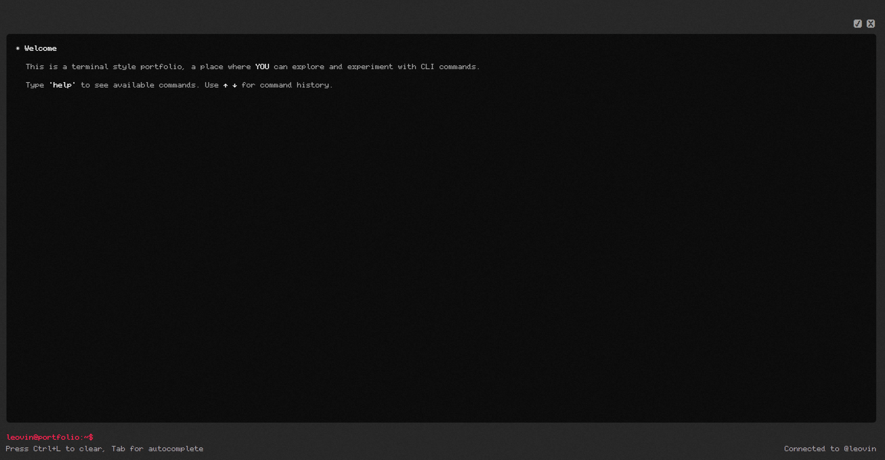

<div align="center">
<a href="https://github.com/leovin98/my-terminal" target="blank">
</a>

<h2> My Terminal </h2>




</div>

## 💡 Overview

**My Terminal** is an interactive, terminal style portfolio website that lets users explore content through typed commands.  
It blends a retro command-line aesthetic with modern web technologies, offering a simple, creative, and customizable way to showcase personal or professional projects.

## ✨ Features

- **💻 Terminal Interface:** Fully simulated terminal environment that responds to user commands in real time.
- **🧭 Command Navigation:** Type commands like `help`, `whoami`, `projects`, or `skills` to explore the portfolio content.
- **🕹 Command History:** Use the ↑ / ↓ arrow keys to cycle through previously entered commands.
- **⚡ Autocomplete:** Press Tab to autocomplete known commands just like in a real shell.
- **🧹 Clear Command:** Press Ctrl + L to clear the screen and reset the prompt.
- **📱 Responsive Design:** Access on any device with adaptive design.

## 👩‍💻 Tech Stack

- **Next.js** – A React framework for building server side rendered and static web applications.
- **React** – A JavaScript library for building dynamic user interfaces.
- **Tailwind CSS** – A utility CSS framework for fast and responsive styling.
- **TypeScript** – Adds static typing and improved developer experience.
- **Node.js** – Provides the runtime environment for running JavaScript on the server side.
- **NPM** – Used for managing project dependencies and packages.

## 📖 Sources

- [Next.js](https://nextjs.org/) – Main framework for building and deploying the web application.
- [NPM](https://www.npmjs.com/) – Manages project dependencies and packages.
- [Node.js](https://nodejs.org/en) – Provides the runtime environment for executing JavaScript on the server.

## 📦 Getting Started

To get a local copy of this project up and running, follow these steps.

### 🚀 Prerequisites

- [Node.js](https://nodejs.org/) and [npm](https://www.npmjs.com/) installed on your machine.

## 🛠️ Installation

1. **Clone the repository:**

   ```bash
   git clone https://github.com/leovin/my-terminal.git
   cd my-terminal
   ```

2. **Install dependencies:**

   Using Npm:

   ```bash
   npm install
   ```

3. **Start the development server:**

   ```bash
   npm run dev
   ```
